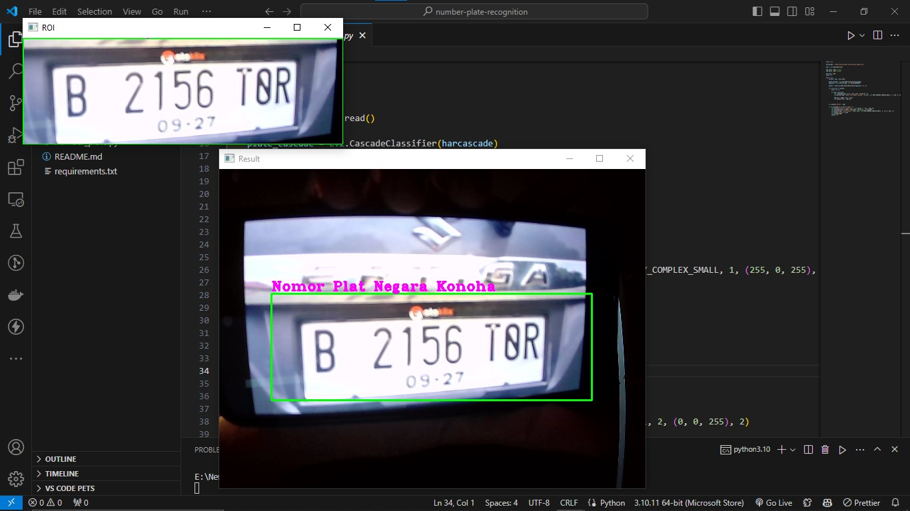

## Number Plate Detection

This code is open source
License Plate Detection is a technology that uses image processing and object detection algorithms to identify areas in an image or video that are likely to contain vehicle license plates, followed by character segmentation and character recognition to automatically extract license plate information. In contrast, the [YOLOv5](https://github.com/JosuaLimbu/yolov5-objectdetect.git) project is harder and more accurate. Maybe it's almost the same as [NPR-Tesseract](https://github.com/JosuaLimbu/npr-tesseract.git), but the difference is that for this project, only object detection. not up to using Optical Character Recognition.

### Install

**Install on Windows**

Install [Git Bash](https://git-scm.com/downloads) and [Python](https://www.python.org/downloads/) first

After that, open git bash and follow these commands

```bash
$ git clone https://github.com/JosuaLimbu/number-plate-detection.git
$ cd number-plate-detection
$ pip install -r requirements.txt
$ python3 number_plate.py
```

And the code is ready to use.
The end result will be like this.

